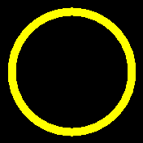

# banglejs-2-fillring #

draws a filled ring on a Bangle.js 2

This module adds a method `fillring` for drawing filled circular rings to the global graphics context `g`.



The new method has the signature

```javascript
g.fillring(cx,cy, r1,r2);
```

with the following parameters:

* `cx` - x coordinate of the ring's center
* `cy` - y coordinate of the ring's center
* `r1` - outer ring radius
* `r2` - inner ring radius

The ring is drawn and filled with current foreground color.

## License ##

[MIT License](LICENSE.md)
